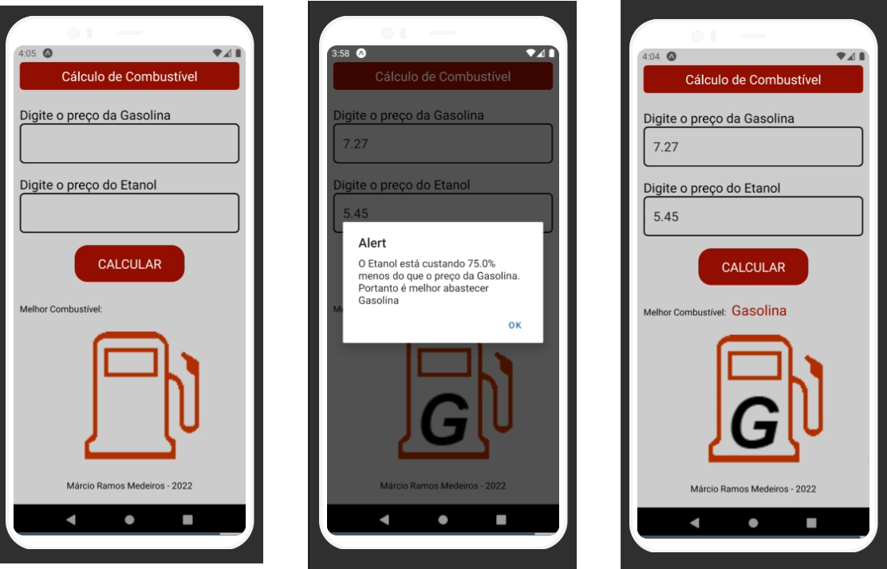

<h1 align="center"> 
  Aplicativo - Cálculo de Combustível
</h1>

<h3 align="center">
O projeto desenvolvido foi um aplicativo de Cálculo de Combustível, que permite saber se é melhor abastecer o veículo com Gasolina ou Etanol. O aplicativo foi desenvolvido apenas para praticar e exercitar o uso do React Native.
</h3>

 

### Funcionalidades

- Cálculo de Combustível. 

 

### Tecnologias 

Esse projeto foi desenvolvido utilizando:

-  [React Native](https://reactnative.dev/);
 

### License
Esse projeto está sob MIT license. Veja [LICENSE](https://github.com/belapferreira/conceitos-react-native/blob/master/LICENSE) para mais informações.

 

<h3 align="center"> Imagem do App </h3> 

 

---
<h3 align="center">
 Feito por Márcio Ramos Medeiros - 2022
 </h3>

